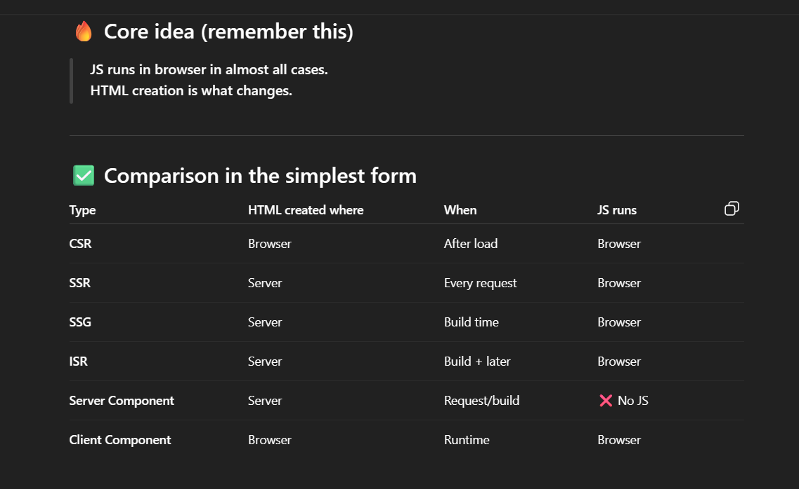

🔍 Rendering types in Next.js (simple table)
| Mode | Meaning |
| ------- | ------------------------- |
| **SSG** | Built once at build time |
| **ISR** | Rebuilt after some time |
| **SSR** | Rendered on every request |

🧠 Where force-dynamic fits
| Setting | Result |
| ----------------- | ----------------------- |
| nothing | auto (Next decides) |
| `force-static` | SSG |
| `revalidate = 60` | ISR |
| ✅ `force-dynamic` | **SSR (every request)** |

Yes — by default, every page.tsx in the App Router is a Server Component. ✅
But server ≠ SSR automatically. This is the important distinction.



<!-- RUN SERVER COMP  -->

Perfect 👍
Here’s a **short, clean, copy-paste–ready explanation** you can add directly to your `docs.md` or `README.md`.

---

## 📘 Data Fetching Approach (Next.js App Router)

### ✅ Why we fetch data directly in `page.tsx`

In Next.js App Router, **pages are Server Components by default**.
This means they run **on the backend**, not in the browser.

Because of this, Server Components can:

- Access the database directly (Prisma)
- Run secure logic
- Return fully rendered HTML to the client

So fetching data like this is the **recommended approach**:

```ts
const [stats, tasks, notifications] = await Promise.all([
  getStats(),
  getTasks(),
  getNotifications(),
]);
```

---

### 🚀 Benefits of this approach

#### 1️⃣ Better Performance

- No HTTP request to `/api/*`
- No server calling itself
- Direct DB → Server → HTML flow
- Faster page load

#### 2️⃣ Full Type Safety

- Prisma returns real objects (e.g., `Date`)
- No JSON serialization
- No manual `new Date()` conversion
- Better TypeScript inference

#### 3️⃣ Simpler Code

- No `fetch`
- No `res.json()`
- No loading or error states
- Single render with complete data

---

### ⚡ Why no loading state is needed

Server Components render **only after data is ready**.

Flow:

1. Server fetches all data
2. Server builds HTML
3. Browser receives final UI

The user never sees partial or loading data.

---

### ❌ Why API routes are not used here

Creating `/api/dashboard` for a Server Component is an **anti-pattern** because it causes:

- Unnecessary HTTP calls
- Extra JSON parsing
- More code with no benefit

---

### ✅ When API routes SHOULD be used

Use API routes only when:

- Data is fetched from a **Client Component**
- A **mobile app** (React Native / Flutter) needs the data
- You are building a **public API**

---

### 📌 Rule to remember

> **Server Components → Direct DB access**
> **Client Components → API routes**

This keeps the application fast, clean, and fully aligned with Next.js best practices.

---

If you want, I can also give you a **very small architecture diagram (ASCII style)** for docs — looks very professional in README 😄

<!-- CALL FROM THE DB ONLY NOT IN THE CLIENT SIDE   -->

why we are calling the session in both the layout.tsx and page.tsx
This is the most critical concept to understand in Next.js App Router.

Here is the direct answer:

You physically CANNOT call getServerSession inside a Client Component (like Sidebar). Your app will crash immediately.

Here is the breakdown of why, and why the Provider is the only good solution.

1. The "Environment" Wall

getServerSession runs Node.js code. It needs to read server headers, access encrypted environment variables (AUTH_SECRET), and decrypt cookies.

Client Components ("use client") run in the User's Browser (Chrome/Safari).

If you type await getServerSession() inside your Sidebar, the browser says: "I don't have access to the server's secret keys or file system," and it throws an error.

2. "But can't I use the useSession() hook instead?"

Yes, you can use import { useSession } from "next-auth/react" in the client. But you shouldn't use it for the Sidebar.

Here is the difference:

❌ Scenario A: Using useSession() in Sidebar

User loads page.

Server sends HTML (Sidebar is blank because browser doesn't know user yet).

Browser loads JavaScript.

Sidebar makes a network request to /api/auth/session.

Wait 200ms...

Sidebar receives user data and "Pops" into existence.

Result: FLICKERING. The user sees a loading spinner or empty space, then the avatar jumps in. It feels cheap.

✅ Scenario B: Using your DashboardProvider

Server (Layout) gets the session during the initial build.

Server embeds the user data inside the HTML passed to the Provider.

User loads page.

Sidebar is already there.

Result: INSTANT. No loading, no flickering, no network requests.

Summary
Method Where it works Performance Visual Result
getServerSession Server Only (page.tsx) ⚡ Instant (0ms) Perfect
useSession Hook Client Only (Sidebar.tsx) 🐢 Slow (Network Request) Flickers / Loading Spinner
Provider (Context) Client Only ⚡ Instant (Passed from Server) Perfect (No flicker)

Conclusion: You are using the Provider to teleport the data from the Server (Layout) to the Client (Sidebar) instantly without making the browser fetch it again. This is the professional way to build Next.js apps.

This is the final piece of the puzzle. The answer is NO, it is not DB heavy, but YES, it is annoying to type.
Here is how to solve both problems.

1. Why it is NOT "DB Heavy" (The Truth about Memoization)
   You are worried that if you have 5 server components on one page, and they all call getServerSession, you will hit the database 5 times.
   That is FALSE.
   Next.js is extremely smart. It uses Request Memoization.
   Layout calls getServerSession → Executes logic → Hits DB → Saves Result.
   Page calls getServerSession → Returns Saved Result (0ms, 0 DB calls).
   Component A calls getServerSession → Returns Saved Result (0ms, 0 DB calls).
   Result: No matter how many times you call it in one page load, the Database is checked exactly ONCE.

✅ Why server components call DB again

Because server has no memory.

Each request is new and isolated.

So server cannot remember data from previous request.

This is done on purpose so apps can scale safely.

✅ How it still works fast

DB uses connection pooling

Next.js deduplicates requests

Servers are stateless and scalable

So calling DB again is normal and cheap.


