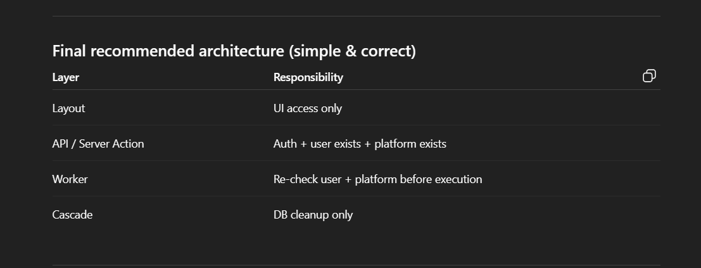

we are checking both the user and platform account both ..

# Application Architecture Documentation


---

## 📋 Quick Overview

This app uses a **simple 4-layer architecture**. Each layer has ONE job:

| Layer                   | Job                | Example                                  |
| ----------------------- | ------------------ | ---------------------------------------- |
| **Layout**              | Show UI only       | Display forms, buttons, pages            |
| **API / Server Action** | Check permissions  | Auth + validate user + validate platform |
| **Worker**              | Do the actual work | Execute tasks, call external APIs        |
| **Cascade**             | Clean up database  | Auto-delete related records              |

**Why?**

- ✅ Easy to understand and maintain
- ✅ Each piece does one thing well
- ✅ Secure by design
- ✅ Database stays clean automatically

---

## The 4 Layers

### 1. Layout Layer

**Job:** UI access only

```typescript
// Just show stuff to users
export default function DashboardPage() {
  return (
    <div>
      <h1>Dashboard</h1>
      <TaskList />
    </div>
  )
}
```

**What it does:**

- ✅ Render components
- ✅ Show data
- ✅ Capture user input

**What it does NOT do:**

- ❌ No authentication
- ❌ No business logic
- ❌ No database calls

---

### 2. API / Server Action Layer

**Job:** Auth + user exists + platform exists

```typescript
export async function POST(req: Request) {
  // 1. Check user is logged in
  const session = await auth();
  if (!session)
    return Response.json({ error: "Unauthorized" }, { status: 401 });

  // 2. Check user exists in database
  const user = await prisma.user.findUnique({ where: { id: session.userId } });
  if (!user) return Response.json({ error: "User not found" }, { status: 404 });

  // 3. Check platform is connected
  const platform = await prisma.platformAccount.findFirst({
    where: { userId: user.id, platform: req.body.platform },
  });
  if (!platform)
    return Response.json({ error: "Platform not connected" }, { status: 400 });

  // 4. Pass to Worker to do the actual work
  const result = await createTaskWorker({
    userId: user.id,
    platformId: platform.id,
    ...req.body,
  });

  return Response.json(result);
}
```

**What it does:**

- ✅ Authenticate users
- ✅ Validate user exists
- ✅ Validate platform exists
- ✅ Pass work to Worker layer

**What it does NOT do:**

- ❌ No business logic
- ❌ No task execution
- ❌ No external API calls

---

### 3. Worker Layer

**Job:** Re-check user + platform before execution

```typescript
export async function executeTaskWorker(taskId: string) {
  // 1. Double-check user still exists (defense in depth)
  const task = await prisma.task.findUnique({
    where: { id: taskId },
    include: { user: true },
  });
  if (!task?.user) {
    console.log("User deleted, skipping task");
    return;
  }

  // 2. Double-check platform still exists
  const platform = await prisma.platformAccount.findFirst({
    where: { userId: task.userId },
  });
  if (!platform) {
    await prisma.task.update({
      where: { id: taskId },
      data: { status: "failed" },
    });
    return;
  }

  // 3. Do the actual work
  const execution = await prisma.taskExecution.create({
    data: { taskId, platform: platform.platform, status: "running" },
  });

  try {
    // Post to Twitter/LinkedIn/etc
    const accessToken = decrypt(platform.encryptedAccessToken);
    await postToSocialMedia({
      platform: platform.platform,
      accessToken,
      content: task.content,
    });

    // Mark as success
    await prisma.taskExecution.update({
      where: { id: execution.id },
      data: { status: "success", finishedAt: new Date() },
    });
  } catch (error) {
    // Mark as failed
    await prisma.taskExecution.update({
      where: { id: execution.id },
      data: { status: "failed", error: error.message },
    });
  }
}
```

**What it does:**

- ✅ Re-validate everything
- ✅ Execute business logic
- ✅ Call external APIs (Twitter, LinkedIn)
- ✅ Handle success/failure

**What it does NOT do:**

- ❌ No UI rendering
- ❌ No database cleanup

---

### 4. Cascade Layer

**Job:** DB cleanup only

```prisma
// prisma/schema.prisma

model User {
  id    String @id
  tasks Task[]
}

model Task {
  id     String @id
  userId String

  user       User            @relation(fields: [userId], references: [id], onDelete: Cascade)
  executions TaskExecution[]
}

model TaskExecution {
  id     String @id
  taskId String

  task Task @relation(fields: [taskId], references: [id], onDelete: Cascade)
}
```

**What it does:**

- ✅ When user is deleted → all tasks are auto-deleted
- ✅ When task is deleted → all executions are auto-deleted
- ✅ Keeps database clean automatically

**What it does NOT do:**

- ❌ No manual cleanup code needed!

---

## How It Works

### Example: User Creates a Task

```
┌──────────┐
│  User    │ Fills form and clicks "Create Task"
└────┬─────┘
     │
     ▼
┌──────────────────┐
│  LAYOUT LAYER    │ Shows form, captures input
└────┬─────────────┘
     │
     ▼
┌────────────────────────┐
│  API LAYER             │ 1. Check auth ✓
│                        │ 2. Check user exists ✓
│                        │ 3. Check platform connected ✓
└────┬───────────────────┘
     │
     ▼
┌────────────────────────┐
│  WORKER LAYER          │ 1. Re-check user ✓
│                        │ 2. Re-check platform ✓
│                        │ 3. Create task in DB
│                        │ 4. Schedule for posting
└────────────────────────┘
```

### Example: User Deletes Account

```
┌──────────┐
│  User    │ Clicks "Delete Account"
└────┬─────┘
     │
     ▼
┌──────────────────┐
│  LAYOUT LAYER    │ Shows confirmation dialog
└────┬─────────────┘
     │
     ▼
┌────────────────────────┐
│  API LAYER             │ 1. Check auth ✓
│                        │ 2. Confirm user wants to delete
└────┬───────────────────┘
     │
     ▼
┌────────────────────────┐
│  CASCADE LAYER         │ Delete user → Database automatically deletes:
│  (Database)            │ • All accounts
│                        │ • All sessions
│                        │ • All platform_accounts
│                        │ • All tasks
│                        │ • All task_executions
└────────────────────────┘
```

---

## Code Examples

### Complete Example: Create Task Flow

**1. Layout (Form)**

```typescript
// app/components/task-form.tsx
'use client'

export function TaskForm() {
  async function handleSubmit(formData: FormData) {
    await createTask(formData) // Calls API layer
  }

  return (
    <form action={handleSubmit}>
      <textarea name="content" placeholder="What do you want to post?" />
      <select name="platform">
        <option value="twitter">Twitter</option>
        <option value="linkedin">LinkedIn</option>
      </select>
      <button>Create Task</button>
    </form>
  )
}
```

**2. API Layer (Validation)**

```typescript
// app/actions/create-task.ts
"use server";

export async function createTask(formData: FormData) {
  // 1. Auth check
  const session = await auth();
  if (!session) throw new Error("Not logged in");

  // 2. User exists check
  const user = await prisma.user.findUnique({ where: { id: session.userId } });
  if (!user) throw new Error("User not found");

  // 3. Platform exists check
  const platform = await prisma.platformAccount.findFirst({
    where: { userId: user.id, platform: formData.get("platform") },
  });
  if (!platform) throw new Error("Connect your account first");

  // 4. Pass to Worker
  return await createTaskWorker({
    userId: user.id,
    platformId: platform.id,
    content: formData.get("content"),
  });
}
```

**3. Worker Layer (Execution)**

```typescript
// lib/workers/create-task.ts

export async function createTaskWorker(data) {
  // 1. Re-check user exists
  const user = await prisma.user.findUnique({ where: { id: data.userId } });
  if (!user) throw new Error("User was deleted");

  // 2. Re-check platform exists
  const platform = await prisma.platformAccount.findUnique({
    where: { id: data.platformId },
  });
  if (!platform) throw new Error("Platform disconnected");

  // 3. Create task
  const task = await prisma.task.create({
    data: {
      userId: user.id,
      content: data.content,
      status: "pending",
    },
  });

  // 4. Schedule it
  await scheduleTask(task.id);

  return task;
}
```

**4. Cascade Layer (Auto-cleanup)**

```prisma
// prisma/schema.prisma
model User {
  id    String @id
  tasks Task[]
}

model Task {
  id     String @id
  userId String
  user   User   @relation(fields: [userId], references: [id], onDelete: Cascade)
  //                                                          ^^^^^^^^^^^^^^^^
  //                                                          Auto-delete when user deleted
}
```

---

## Key Rules

### ✅ DO

1. **Always check auth in API layer**

   ```typescript
   const session = await auth();
   if (!session) throw new Error("Unauthorized");
   ```

2. **Always re-check in Worker layer**

   ```typescript
   const user = await prisma.user.findUnique({ where: { id } });
   if (!user) return; // User was deleted, skip work
   ```

3. **Use Prisma cascade for cleanup**

   ```prisma
   user User @relation(fields: [userId], references: [id], onDelete: Cascade)
   ```

4. **Keep business logic in Worker only**
   ```typescript
   // ✅ Good - in Worker
   await postToTwitter(content);
   ```

### ❌ DON'T

1. **Don't put business logic in Layout**

   ```typescript
   // ❌ Bad - Layout should just show UI
   function Page() {
     const result = await complexCalculation();
   }
   ```

2. **Don't skip auth checks**

   ```typescript
   // ❌ Bad - always check auth
   export async function POST(req) {
     await prisma.task.create(...) // No auth check!
   }
   ```

3. **Don't manually delete related records**

   ```typescript
   // ❌ Bad - let cascade handle it
   await prisma.task.deleteMany({ where: { userId } });
   await prisma.user.delete({ where: { id: userId } });

   // ✅ Good - cascade does it automatically
   await prisma.user.delete({ where: { id: userId } });
   ```

---

## Why This Works

### Defense in Depth

- API checks auth → Worker re-checks auth
- If user deleted between layers → Worker catches it
- Multiple safety checks prevent bugs

### Separation of Concerns

- Layout = UI
- API = Security
- Worker = Logic
- Cascade = Cleanup

### Easy to Test

```typescript
// Test each layer independently
test('API rejects unauthenticated requests', ...)
test('Worker validates user exists', ...)
test('Cascade deletes related records', ...)
```

### Easy to Debug

- Know which layer to look at
- Each layer has clear responsibility
- Logs show which layer failed

---

## Quick Reference

```
USER ACTION
    ↓
LAYOUT (Show UI)
    ↓
API (Check: Auth + User + Platform)
    ↓
WORKER (Re-check + Execute + Update DB)
    ↓
CASCADE (Auto-cleanup when deleting)
```

**Remember:**

- Layout = Show
- API = Guard
- Worker = Work
- Cascade = Clean

---

## Adding Images

Add this image to your docs:

```
your-project/
├── README-ARCHITECTURE.md
└── docs/
    └── images/
        └── architecture-diagram.png  ← Add your screenshot here
```

Then it will display at the top of this README!
